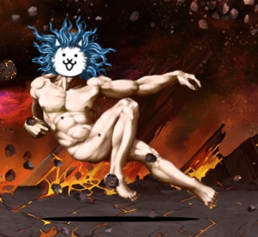
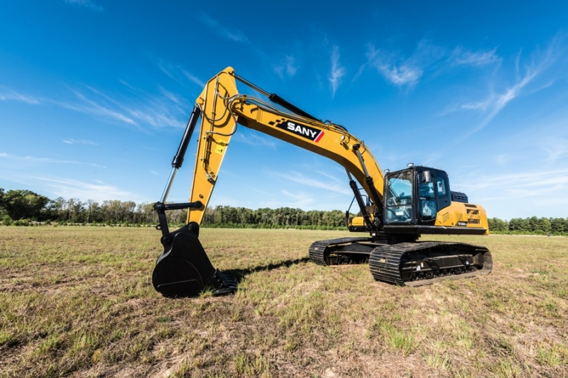

peak dnd convo v google docs

misko: cica owner 
matko: victim of cica 

misko co robis v mojom tabe 
Hladam moju stratenu cicu 
/Mnau* 
A TU SI 
Pod sem 
*odisiel som s cicou* 
Ja viem 
*mnau* 
Matko cica ta pozdravuje 
*mnau* 
A odkazuje ti ze ti praje vela stastia s characterom 
Manu manu manu mnau mnau mnau 
Cica dakuje za tvoje mile slova 
Cica je teraz flabbergasted 
*cica place* 
*hladkam cicu* 
*cica v poriadku* 
*cica odchadza* 
NIE NEODCHADZAJ 
*cica sa vrati* 
*mnau* 
“Hladkam cicu” 
*vrr* 
“Hladkam cicu agresivnejsie” 
*vrrr (zaradene na 5)* 
“Pouzijem jej chovst ako radiacu paku a zaradim 6” 
*vrr (zaradene na 6)* 
“Stupil som jej jemne na nohu ako na plin aby zrichlila” 
*mnau - zlomil si cice nohu* 
“NIE PREPAC CICA TO SOM NECCHEL” 
*cica castne spell a vylieci sa* 
“Pochvalim cicu ze je sikovna” 
*mnau* 
“Urobil som stojku” 
*cica zacne tlieskat a castne spell vdaka ktoremu privola cica boha* 
 
“Ohromene sa pozeram na mejstatnost toho boha” 
*boh povie mnau, despawne sa a summone bager* 
 
“Ako som uvidel bager tak som donho skocil a natartoval” 
*ale namiesto zvukov motora si pocul vrr a mnaukanie* 
“O moj boze cico boh sa zmenil na bager :O” 
“Ktora cast jeho tela je radiaca paka? Spytal som sa.” 
*palec, chvost je vidlica - odpovie macaci boh cez vyfuk uplne plynulov ludskov recou* 
“S uzasom som pocuval jeho medovy hlas”